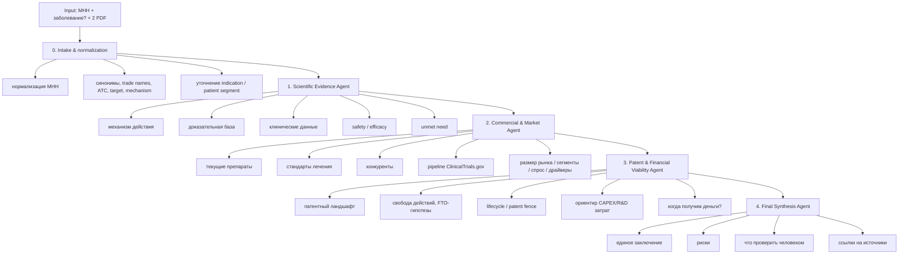

## Вопросы
1. PDF - обязательный источник?
2. Еще раз уточнить формат финального отчета - главная задача: сделать MVP системы для анализа рынка, на основе этой системы ручками собрать кейсы - голдены, на основе голденов генерировать синтетику ? Может, имеет смысл выводить как можно больше информации по анализу
3. Первый шаг - нормализация, насыщаем наш сырой input - МНН + заболевание, потом с помощью словарей и LLM насыщаем, потом просим человека проверить - проверку делать обязательно или если только установлен флан неполноты?

## План по реализации

Этап 1 — прототип
- FastAPI endpoint: /analyze
- Input: INN, disease, 2 PDF
- LangGraph из 4 узлов
- OpenRouter LLM
- PDF retrieval
- web search
- structured JSON output
- markdown report

Этап 2 — источники
- ClinicalTrials.gov API
- PubMed / Europe PMC
- Google Patents / Lens / Espacenet
- drug labels: FDA, EMA
- guidelines: NICE, ESMO, NCCN, WHO, если применимо

Этап 3 — качество
- LangSmith datasets
- 20–50 тестовых кейсов
- human review
- regression tests
- сравнение моделей OpenRouter

Этап 4 — production
- Postgres + pgvector
- очереди задач
- cost tracking
- user accounts
- report versioning
- export DOCX/PDF
- dashboard логов

## Tech Stack:

- Backend: Python + FastAPI
- Agent orchestration: LangGraph
- LLM access: OpenRouter
- Tracing/evals: LangSmith
- PDF parsing: PyMuPDF / pypdf + chunking + vector store
- Search: Tavily / SerpAPI / Exa / собственный Google/Bing wrapper
- Clinical trials: ClinicalTrials.gov API
- Patents: Google Patents search, Lens.org, Espacenet, PatentsView, - WIPO Patentscope
- Storage: Postgres + pgvector
- Queue: Celery / Dramatiq / Temporal
- Logs: structlog + OpenTelemetry + LangSmith traces
- Frontend: Streamlit для MVP или React/Next.js для продукта

## Целевая архитектура



## Step 0. NormalizedInput, Human-in-the-Loop

Нормализует:

- МНН
- заболевание
- синонимы
- drug class
- mechanism hypothesis
- target population hypothesis
- ambiguity flag (неоднозначность, необходим человеческий апрув и коррективы ??) Если True, то просим человека проверить или просим проверить человека всегда???

Schema:
```json
{
  "inn": "string",
  "disease": "string | null",
  "synonyms": ["string"],
  "drug_class": "string | null",
  "mechanism_hypothesis": "string | null",
  "target_population_hypothesis": "string | null",
  "needs_human_review": false
}
```

Пример: 
Input:
МНН: Keytruda
Заболевание: рак лёгких

```json
{
  "inn": "pembrolizumab",
  "disease": "non-small cell lung cancer",
  "synonyms": ["keytruda", "pembrolizumab"],
  "drug_class": "PD-1 inhibitor",
  "mechanism_hypothesis": "immune checkpoint inhibition via PD-1 blockade",
  "target_population_hypothesis": "patients with advanced or metastatic NSCLC, potentially stratified by PD-L1 expression",
  "needs_human_review": false
}
```

Зачем надо: понять, что именно имел человек, насытить для агентов

Как это работает:
user input
  -> preprocessing
  -> терминологические словари / справочники
  -> LLM normalization
  -> schema validation
  -> ambiguity checks
  -> NormalizedInput

  


## Agent I: Scientific Evidence Agent

**Задача**: ответить, есть ли научная основа для разработки/применения МНН при заболевании.

Проверяет:

1. Механизм действия
2. Биологическая правдоподобность
3. Доклинические данные
4. Клинические данные
5. Эффективность
6. Безопасность
7. Конечные точки
8. Unmet medical need
9. Качество доказательств
10. Что неизвестно

Выход:

```json
{
  "mechanism_of_action": "...",
  "disease_rationale": "...",
  "evidence_summary": "...",
  "clinical_evidence": [],
  "safety_concerns": [],
  "unmet_need": "...",
  "major_risks": [],
  "open_questions": [],
  "citations": []
}
```

## Agent II: Commercial & Market Agent

Задача: ответить, есть ли спрос и рыночная возможность.

Проверяет:

1. Что сейчас есть на рынке
2. Какие препараты назначают врачи
3. Плюсы и минусы текущей терапии
4. Золотой стандарт
5. Pipeline конкурентов
6. ClinicalTrials.gov: фазы, sponsors, сроки
7. Размер пациентской популяции
8. Целевой сегмент
9. Драйверы рынка
10. Барьеры reimbursement
11. Цена конкурентов
12. Гипотеза продаж

Выход:
```json
{
  "current_standard_of_care": "...",
  "marketed_drugs": [],
  "competitor_pipeline": [],
  "clinical_trials_summary": [],
  "patient_population": "...",
  "target_segment": "...",
  "market_drivers": [],
  "payer_value": "...",
  "pricing_benchmark": "...",
  "sales_hypothesis": "...",
  "when_money_may_arrive": "...",
  "citations": []
}
```

## Agent 3: Patent & Financial Viability Agent

Задача: ответить, свободен ли путь и сколько нужно вложить.

Проверяет:

1. Патенты на молекулу
2. Патенты на способ получения
3. Патенты на indication
4. Патенты на formulation
5. Патенты на combinations
6. Даты истечения
7. Основные правообладатели
8. Количество релевантных патентных семейств
9. FTO-риск
10. Возможности собственного patent fence
11. Оценка R&D бюджета
12. Оценка времени до выручки

Выход:

```json
{
  "patent_landscape": "...",
  "key_assignees": [],
  "relevant_patent_families": [],
  "estimated_active_patent_count": null,
  "freedom_to_operate_risks": [],
  "patent_fence_opportunities": [],
  "development_cost_range": {
    "low": "...",
    "base": "...",
    "high": "..."
  },
  "time_to_revenue": "...",
  "investment_recommendation": "...",
  "citations": []
}
```

Важно: FTO нельзя отдавать как юридическое заключение. В интерфейсе нужно писать: “preliminary patent intelligence, not legal FTO opinion”.

## PDF-модуль

?? Проиндексировать БД один раз?
?? Умное чанкирование по разделам

PDF как обязательный источник.

Pipeline:

1. Load PDF
2. Extract text
3. Split into chunks
4. Detect tables
5. Store chunks in pgvector
6. Retrieve top-k chunks per agent
7. Force citation to PDF chunks
8. Проверить: использованы ли оба PDF

Для каждого запуска сохранять:

```json
{
  "pdf_name": "...",
  "page": 12,
  "chunk_id": "...",
  "quoted_text": "...",
  "used_by_agent": "commercial_agent"
}
```

## Логирование

Обязательно логировать на 4 уровнях.

A. Business logs
- input МНН
- disease
- дата анализа
- версия промптов
- версия модели
- какие источники использованы
- какие PDF использованы
- финальный статус

B. Agent logs
- start/end каждого агента
- tools called
- search queries
- найденные URL
- исключённые URL
- ошибки парсинга
- retries

C. LLM logs
- model
- temperature
- token usage
- latency
- cost
- raw output
- parsed JSON
- validation errors

D. Audit logs
- кто запустил анализ
- когда
- какие документы загрузил
- какой отчёт получил
- изменялся ли отчёт человеком

LangSmith: tracing/evaluation 
Structured logs: Postgres/ClickHouse/ELK

## Guardrails

1. Нет источников → агент не может делать уверенное заключение.
2. Не использованы оба PDF → run считается incomplete.
3. Нет ClinicalTrials.gov поиска → commercial block incomplete.
4. Нет patent search → financial block incomplete.
5. JSON не прошёл schema validation → retry.
6. Слишком старые источники → warning.
7. МНН не найден → остановка или режим hypothesis.

## Формат финального отчета

1. Executive summary
2. Научная обоснованность
3. Коммерческая привлекательность
4. Рынок и спрос
5. Конкуренты и pipeline
6. Стандарты лечения
7. Патентный ландшафт
8. Финансовая жизнеспособность
9. Когда возможно получить деньги
10. Сколько нужно вложить
11. Главные риски
12. Что нужно проверить экспертом
13. Источники


